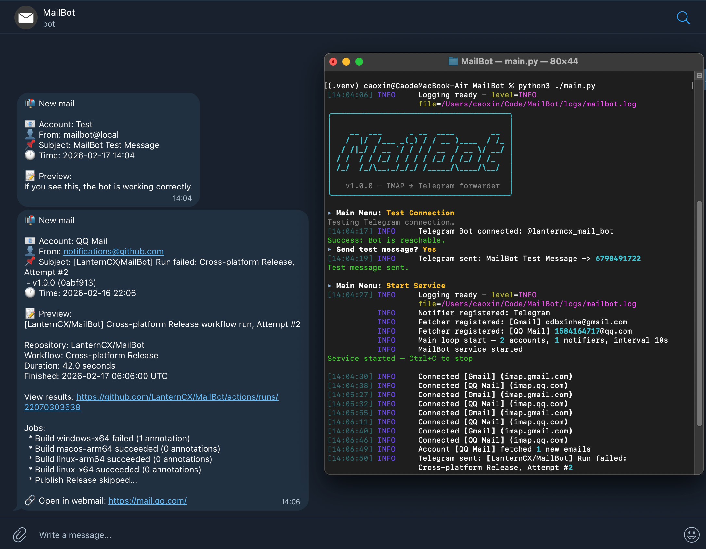
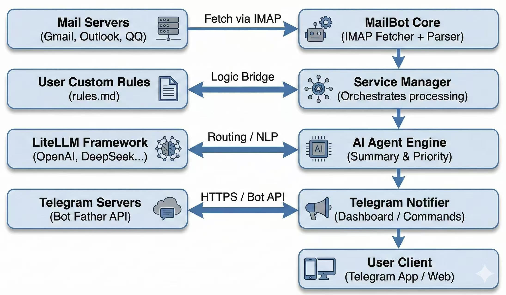

# 🤖 MailBot


[中文](README_ZH.md) | [English](README.md)

> Your AI Mail Management Agent

An intelligent assistant that understands, summarizes, and processes your emails according to your rules.

---

## 🎬 Preview



## ✨ Features

- **AI Agent**: LLM-based email content understanding, importance detection, and summarization.
- **Ultra-low Cost**: Minimal prompt usage ensures extremely low token costs.
- **Multi-Provider**: Seamless integration with OpenAI, Claude, Gemini, DeepSeek, Ollama, etc.
- **Rule Engine**: Define your email processing preferences via Telegram using natural language.
- **Multi-Language Support**: Automatic language detection and translation to break reading barriers.
- **Interactive Setup**: CLI wizard for easy account and AI configuration management.
- **Privacy First**: Supports local models (Ollama) and self-hosted APIs for complete data control.

## 🧠 Supported Models

MailBot supports a wide range of LLM providers via LiteLLM:

| Provider Group | Supported Providers |
| :--- | :--- |
| **OpenAI & Compatible** | OpenAI, OpenRouter, Together AI, Fireworks AI |
| **Frontier Models** | Anthropic (Claude), Google Gemini, Mistral, Groq |
| **China-Friendly** | DeepSeek, Qwen, Moonshot, MiniMax |
| **Research / Web** | Perplexity, Cohere |
| **Local & Custom** | Ollama, Custom OpenAI-Compatible |

For a full list of models supported by LiteLLM, please refer to the [LiteLLM Providers Documentation](https://docs.litellm.ai/docs/providers).

## 🚀 Quick Start

### Method 1: Executable (Recommended)

1. **Download & Unzip**  
   Get the release package from [Releases](../../releases/latest) and extract it.

   ```bash
   # Example: Unzip the downloaded file
   unzip mailbot-v1.0.0-macos-arm64.zip -d mailbot
   cd mailbot
   ```

2. **Run Application**  
   Execute the binary. The `config.json` will be created automatically if missing.

   **Linux / Windows (PowerShell):**
   ```bash
   # Linux
   chmod +x mailbot-linux-amd64
   ./mailbot-linux-amd64

   # Windows
   .\mailbot-windows-amd64.exe
   ```

   **macOS (Requires Gatekeeper clearance):**
   ```bash
   # Remove quarantine attribute
   xattr -d com.apple.quarantine mailbot-macos-arm64
   
   # Run
   ./mailbot-macos-arm64
   ```

3. **Configuration Wizard**  
   Follow the interactive wizard to add accounts and set up the bot.
   ```bash
   # Optional: Load a specific config file
   ./mailbot-macos-arm64 -c ./my_config.json
   ```

### Method 2: From Source

```bash
git clone https://github.com/your-username/MailBot.git
cd MailBot
python -m venv .venv && source .venv/bin/activate  # Windows: .venv\Scripts\activate
pip install -r requirements.txt
python main.py
```

## 📖 Documentation

- **[Setup Guide](docs/en/setup_guide.md)**  
  Get your Google App Password, create a Telegram Bot, and find your Chat ID.

- **[Configuration](docs/en/configuration.md)**  
  Detailed explanation of menu options, system settings (polling, retries), and headless mode.

- **Welcome to Contribute**  
  Send a PR or open an issue with improvements, configuration samples, or bug reports—every contribution helps MailBot better support diverse scenarios.

---

## 🖥 Menu Overview

```text
▸ Start Service      — Run in foreground with live logs
▸ Config Wizard      — Add / remove IMAP accounts step-by-step
▸ Bot Settings       — Set / update Telegram Bot Token & Chat ID
▸ System Settings    — Configure polling interval, retries, log level
▸ Test Connection    — Send a test message to Telegram to verify setup
▸ Exit               — Quit application
```

## 🤖 Telegram Commands

| Command | Description |
| :--- | :--- |
| `/start` | Check if the bot is alive |
| `/settings` | Open interactive settings panel (Mode/Language) |
| `/ai` | (Reply to a message) Manually trigger AI analysis |
| `/rules` | View or manage AI directives (Natural language add/remove) |
| `/help` | Show help message |

## 🏗 Project Architecture



## 🏗 Project Structure

```text
MailBot/
├── main.py                 # Entry point
├── config.json             # Auto-generated config (credentials)
├── requirements.txt
├── docs/                   # Documentation (setup, config guides)
├── utils/
│   ├── logger.py           # Rich logging setup
│   └── helpers.py          # UI components
├── core/                   # Core logic
│   ├── models.py           # Data models
│   ├── manager.py          # Service orchestration
│   ├── fetcher.py          # IMAP fetching & retry logic
│   ├── parser.py           # HTML body parsing
│   └── notifiers/          # Notification adapters (Telegram)
└── interface/              # Interactive CLI layer
    ├── menu.py             # Main menu
    └── wizard.py           # Configuration wizards
```

## 📄 License

MIT
